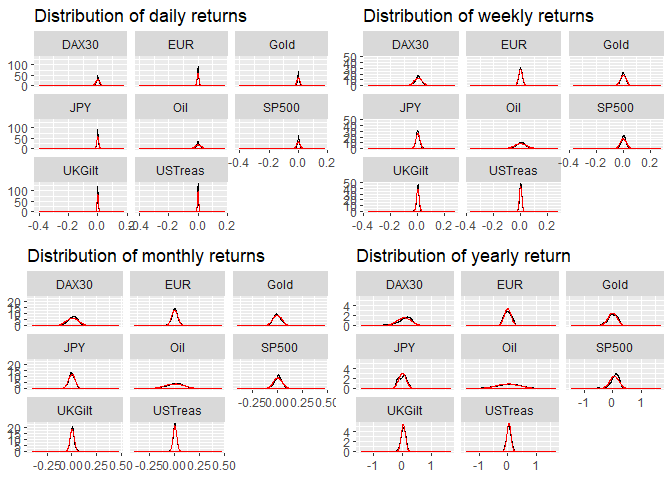

1. Step - Value-at-Risk
=======================

-   We first calculated the Value-at-Risk for all asset classes at
    confidence intervals of 84%, 97.5% and 99.9%. The result is shown in
    the following table:
    <table class="table" style="margin-left: auto; margin-right: auto;">
    <thead>
    <tr>
    <th style="text-align:left;">
    Asset
    </th>
    <th style="text-align:left;">
    VaR
    </th>
    <th style="text-align:right;">
    Value
    </th>
    <th style="text-align:left;">
    Horizon
    </th>
    </tr>
    </thead>
    <tbody>
    <tr>
    <td style="text-align:left;">
    DAX30
    </td>
    <td style="text-align:left;">
    VaR 84%
    </td>
    <td style="text-align:right;">
    0.0112000
    </td>
    <td style="text-align:left;">
    Daily
    </td>
    </tr>
    <tr>
    <td style="text-align:left;">
    EUR
    </td>
    <td style="text-align:left;">
    VaR 84%
    </td>
    <td style="text-align:right;">
    0.0056000
    </td>
    <td style="text-align:left;">
    Daily
    </td>
    </tr>
    <tr>
    <td style="text-align:left;">
    Gold
    </td>
    <td style="text-align:left;">
    VaR 84%
    </td>
    <td style="text-align:right;">
    0.0079000
    </td>
    <td style="text-align:left;">
    Daily
    </td>
    </tr>
    <tr>
    <td style="text-align:left;">
    JPY
    </td>
    <td style="text-align:left;">
    VaR 84%
    </td>
    <td style="text-align:right;">
    0.0055000
    </td>
    <td style="text-align:left;">
    Daily
    </td>
    </tr>
    <tr>
    <td style="text-align:left;">
    Oil
    </td>
    <td style="text-align:left;">
    VaR 84%
    </td>
    <td style="text-align:right;">
    0.0174000
    </td>
    <td style="text-align:left;">
    Daily
    </td>
    </tr>
    <tr>
    <td style="text-align:left;">
    SP500
    </td>
    <td style="text-align:left;">
    VaR 84%
    </td>
    <td style="text-align:right;">
    0.0084000
    </td>
    <td style="text-align:left;">
    Daily
    </td>
    </tr>
    <tr>
    <td style="text-align:left;">
    UKGilt
    </td>
    <td style="text-align:left;">
    VaR 84%
    </td>
    <td style="text-align:right;">
    0.0040000
    </td>
    <td style="text-align:left;">
    Daily
    </td>
    </tr>
    <tr>
    <td style="text-align:left;">
    USTreas
    </td>
    <td style="text-align:left;">
    VaR 84%
    </td>
    <td style="text-align:right;">
    0.0036000
    </td>
    <td style="text-align:left;">
    Daily
    </td>
    </tr>
    <tr>
    <td style="text-align:left;">
    DAX30
    </td>
    <td style="text-align:left;">
    VaR 97.5%
    </td>
    <td style="text-align:right;">
    0.0271000
    </td>
    <td style="text-align:left;">
    Daily
    </td>
    </tr>
    <tr>
    <td style="text-align:left;">
    EUR
    </td>
    <td style="text-align:left;">
    VaR 97.5%
    </td>
    <td style="text-align:right;">
    0.0130000
    </td>
    <td style="text-align:left;">
    Daily
    </td>
    </tr>
    <tr>
    <td style="text-align:left;">
    Gold
    </td>
    <td style="text-align:left;">
    VaR 97.5%
    </td>
    <td style="text-align:right;">
    0.0201000
    </td>
    <td style="text-align:left;">
    Daily
    </td>
    </tr>
    <tr>
    <td style="text-align:left;">
    JPY
    </td>
    <td style="text-align:left;">
    VaR 97.5%
    </td>
    <td style="text-align:right;">
    0.0138775
    </td>
    <td style="text-align:left;">
    Daily
    </td>
    </tr>
    <tr>
    <td style="text-align:left;">
    Oil
    </td>
    <td style="text-align:left;">
    VaR 97.5%
    </td>
    <td style="text-align:right;">
    0.0440424
    </td>
    <td style="text-align:left;">
    Daily
    </td>
    </tr>
    <tr>
    <td style="text-align:left;">
    SP500
    </td>
    <td style="text-align:left;">
    VaR 97.5%
    </td>
    <td style="text-align:right;">
    0.0213775
    </td>
    <td style="text-align:left;">
    Daily
    </td>
    </tr>
    <tr>
    <td style="text-align:left;">
    UKGilt
    </td>
    <td style="text-align:left;">
    VaR 97.5%
    </td>
    <td style="text-align:right;">
    0.0089000
    </td>
    <td style="text-align:left;">
    Daily
    </td>
    </tr>
    <tr>
    <td style="text-align:left;">
    USTreas
    </td>
    <td style="text-align:left;">
    VaR 97.5%
    </td>
    <td style="text-align:right;">
    0.0082000
    </td>
    <td style="text-align:left;">
    Daily
    </td>
    </tr>
    <tr>
    <td style="text-align:left;">
    DAX30
    </td>
    <td style="text-align:left;">
    VaR 99.9%
    </td>
    <td style="text-align:right;">
    0.0651339
    </td>
    <td style="text-align:left;">
    Daily
    </td>
    </tr>
    <tr>
    <td style="text-align:left;">
    EUR
    </td>
    <td style="text-align:left;">
    VaR 99.9%
    </td>
    <td style="text-align:right;">
    0.0261391
    </td>
    <td style="text-align:left;">
    Daily
    </td>
    </tr>
    <tr>
    <td style="text-align:left;">
    Gold
    </td>
    <td style="text-align:left;">
    VaR 99.9%
    </td>
    <td style="text-align:right;">
    0.0510692
    </td>
    <td style="text-align:left;">
    Daily
    </td>
    </tr>
    <tr>
    <td style="text-align:left;">
    JPY
    </td>
    <td style="text-align:left;">
    VaR 99.9%
    </td>
    <td style="text-align:right;">
    0.0341769
    </td>
    <td style="text-align:left;">
    Daily
    </td>
    </tr>
    <tr>
    <td style="text-align:left;">
    Oil
    </td>
    <td style="text-align:left;">
    VaR 99.9%
    </td>
    <td style="text-align:right;">
    0.1134979
    </td>
    <td style="text-align:left;">
    Daily
    </td>
    </tr>
    <tr>
    <td style="text-align:left;">
    SP500
    </td>
    <td style="text-align:left;">
    VaR 99.9%
    </td>
    <td style="text-align:right;">
    0.0582256
    </td>
    <td style="text-align:left;">
    Daily
    </td>
    </tr>
    <tr>
    <td style="text-align:left;">
    UKGilt
    </td>
    <td style="text-align:left;">
    VaR 99.9%
    </td>
    <td style="text-align:right;">
    0.0235955
    </td>
    <td style="text-align:left;">
    Daily
    </td>
    </tr>
    <tr>
    <td style="text-align:left;">
    USTreas
    </td>
    <td style="text-align:left;">
    VaR 99.9%
    </td>
    <td style="text-align:right;">
    0.0183391
    </td>
    <td style="text-align:left;">
    Daily
    </td>
    </tr>
    <tr>
    <td style="text-align:left;">
    DAX30
    </td>
    <td style="text-align:left;">
    VaR 84%
    </td>
    <td style="text-align:right;">
    0.0269000
    </td>
    <td style="text-align:left;">
    Weekly
    </td>
    </tr>
    <tr>
    <td style="text-align:left;">
    EUR
    </td>
    <td style="text-align:left;">
    VaR 84%
    </td>
    <td style="text-align:right;">
    0.0128440
    </td>
    <td style="text-align:left;">
    Weekly
    </td>
    </tr>
    <tr>
    <td style="text-align:left;">
    Gold
    </td>
    <td style="text-align:left;">
    VaR 84%
    </td>
    <td style="text-align:right;">
    0.0189000
    </td>
    <td style="text-align:left;">
    Weekly
    </td>
    </tr>
    <tr>
    <td style="text-align:left;">
    JPY
    </td>
    <td style="text-align:left;">
    VaR 84%
    </td>
    <td style="text-align:right;">
    0.0132000
    </td>
    <td style="text-align:left;">
    Weekly
    </td>
    </tr>
    <tr>
    <td style="text-align:left;">
    Oil
    </td>
    <td style="text-align:left;">
    VaR 84%
    </td>
    <td style="text-align:right;">
    0.0409440
    </td>
    <td style="text-align:left;">
    Weekly
    </td>
    </tr>
    <tr>
    <td style="text-align:left;">
    SP500
    </td>
    <td style="text-align:left;">
    VaR 84%
    </td>
    <td style="text-align:right;">
    0.0198000
    </td>
    <td style="text-align:left;">
    Weekly
    </td>
    </tr>
    <tr>
    <td style="text-align:left;">
    UKGilt
    </td>
    <td style="text-align:left;">
    VaR 84%
    </td>
    <td style="text-align:right;">
    0.0095000
    </td>
    <td style="text-align:left;">
    Weekly
    </td>
    </tr>
    <tr>
    <td style="text-align:left;">
    USTreas
    </td>
    <td style="text-align:left;">
    VaR 84%
    </td>
    <td style="text-align:right;">
    0.0092440
    </td>
    <td style="text-align:left;">
    Weekly
    </td>
    </tr>
    <tr>
    <td style="text-align:left;">
    DAX30
    </td>
    <td style="text-align:left;">
    VaR 97.5%
    </td>
    <td style="text-align:right;">
    0.0562000
    </td>
    <td style="text-align:left;">
    Weekly
    </td>
    </tr>
    <tr>
    <td style="text-align:left;">
    EUR
    </td>
    <td style="text-align:left;">
    VaR 97.5%
    </td>
    <td style="text-align:right;">
    0.0281800
    </td>
    <td style="text-align:left;">
    Weekly
    </td>
    </tr>
    <tr>
    <td style="text-align:left;">
    Gold
    </td>
    <td style="text-align:left;">
    VaR 97.5%
    </td>
    <td style="text-align:right;">
    0.0432000
    </td>
    <td style="text-align:left;">
    Weekly
    </td>
    </tr>
    <tr>
    <td style="text-align:left;">
    JPY
    </td>
    <td style="text-align:left;">
    VaR 97.5%
    </td>
    <td style="text-align:right;">
    0.0329900
    </td>
    <td style="text-align:left;">
    Weekly
    </td>
    </tr>
    <tr>
    <td style="text-align:left;">
    Oil
    </td>
    <td style="text-align:left;">
    VaR 97.5%
    </td>
    <td style="text-align:right;">
    0.0877850
    </td>
    <td style="text-align:left;">
    Weekly
    </td>
    </tr>
    <tr>
    <td style="text-align:left;">
    SP500
    </td>
    <td style="text-align:left;">
    VaR 97.5%
    </td>
    <td style="text-align:right;">
    0.0435950
    </td>
    <td style="text-align:left;">
    Weekly
    </td>
    </tr>
    <tr>
    <td style="text-align:left;">
    UKGilt
    </td>
    <td style="text-align:left;">
    VaR 97.5%
    </td>
    <td style="text-align:right;">
    0.0194000
    </td>
    <td style="text-align:left;">
    Weekly
    </td>
    </tr>
    <tr>
    <td style="text-align:left;">
    USTreas
    </td>
    <td style="text-align:left;">
    VaR 97.5%
    </td>
    <td style="text-align:right;">
    0.0176950
    </td>
    <td style="text-align:left;">
    Weekly
    </td>
    </tr>
    <tr>
    <td style="text-align:left;">
    DAX30
    </td>
    <td style="text-align:left;">
    VaR 99.9%
    </td>
    <td style="text-align:right;">
    0.1268202
    </td>
    <td style="text-align:left;">
    Weekly
    </td>
    </tr>
    <tr>
    <td style="text-align:left;">
    EUR
    </td>
    <td style="text-align:left;">
    VaR 99.9%
    </td>
    <td style="text-align:right;">
    0.0510842
    </td>
    <td style="text-align:left;">
    Weekly
    </td>
    </tr>
    <tr>
    <td style="text-align:left;">
    Gold
    </td>
    <td style="text-align:left;">
    VaR 99.9%
    </td>
    <td style="text-align:right;">
    0.1032742
    </td>
    <td style="text-align:left;">
    Weekly
    </td>
    </tr>
    <tr>
    <td style="text-align:left;">
    JPY
    </td>
    <td style="text-align:left;">
    VaR 99.9%
    </td>
    <td style="text-align:right;">
    0.0717893
    </td>
    <td style="text-align:left;">
    Weekly
    </td>
    </tr>
    <tr>
    <td style="text-align:left;">
    Oil
    </td>
    <td style="text-align:left;">
    VaR 99.9%
    </td>
    <td style="text-align:right;">
    0.1909670
    </td>
    <td style="text-align:left;">
    Weekly
    </td>
    </tr>
    <tr>
    <td style="text-align:left;">
    SP500
    </td>
    <td style="text-align:left;">
    VaR 99.9%
    </td>
    <td style="text-align:right;">
    0.0997209
    </td>
    <td style="text-align:left;">
    Weekly
    </td>
    </tr>
    <tr>
    <td style="text-align:left;">
    UKGilt
    </td>
    <td style="text-align:left;">
    VaR 99.9%
    </td>
    <td style="text-align:right;">
    0.0483648
    </td>
    <td style="text-align:left;">
    Weekly
    </td>
    </tr>
    <tr>
    <td style="text-align:left;">
    USTreas
    </td>
    <td style="text-align:left;">
    VaR 99.9%
    </td>
    <td style="text-align:right;">
    0.0368080
    </td>
    <td style="text-align:left;">
    Weekly
    </td>
    </tr>
    <tr>
    <td style="text-align:left;">
    DAX30
    </td>
    <td style="text-align:left;">
    VaR 84%
    </td>
    <td style="text-align:right;">
    0.0572800
    </td>
    <td style="text-align:left;">
    Monthly
    </td>
    </tr>
    <tr>
    <td style="text-align:left;">
    EUR
    </td>
    <td style="text-align:left;">
    VaR 84%
    </td>
    <td style="text-align:right;">
    0.0274800
    </td>
    <td style="text-align:left;">
    Monthly
    </td>
    </tr>
    <tr>
    <td style="text-align:left;">
    Gold
    </td>
    <td style="text-align:left;">
    VaR 84%
    </td>
    <td style="text-align:right;">
    0.0443600
    </td>
    <td style="text-align:left;">
    Monthly
    </td>
    </tr>
    <tr>
    <td style="text-align:left;">
    JPY
    </td>
    <td style="text-align:left;">
    VaR 84%
    </td>
    <td style="text-align:right;">
    0.0314400
    </td>
    <td style="text-align:left;">
    Monthly
    </td>
    </tr>
    <tr>
    <td style="text-align:left;">
    Oil
    </td>
    <td style="text-align:left;">
    VaR 84%
    </td>
    <td style="text-align:right;">
    0.0894400
    </td>
    <td style="text-align:left;">
    Monthly
    </td>
    </tr>
    <tr>
    <td style="text-align:left;">
    SP500
    </td>
    <td style="text-align:left;">
    VaR 84%
    </td>
    <td style="text-align:right;">
    0.0432800
    </td>
    <td style="text-align:left;">
    Monthly
    </td>
    </tr>
    <tr>
    <td style="text-align:left;">
    UKGilt
    </td>
    <td style="text-align:left;">
    VaR 84%
    </td>
    <td style="text-align:right;">
    0.0207200
    </td>
    <td style="text-align:left;">
    Monthly
    </td>
    </tr>
    <tr>
    <td style="text-align:left;">
    USTreas
    </td>
    <td style="text-align:left;">
    VaR 84%
    </td>
    <td style="text-align:right;">
    0.0215000
    </td>
    <td style="text-align:left;">
    Monthly
    </td>
    </tr>
    <tr>
    <td style="text-align:left;">
    DAX30
    </td>
    <td style="text-align:left;">
    VaR 97.5%
    </td>
    <td style="text-align:right;">
    0.1156750
    </td>
    <td style="text-align:left;">
    Monthly
    </td>
    </tr>
    <tr>
    <td style="text-align:left;">
    EUR
    </td>
    <td style="text-align:left;">
    VaR 97.5%
    </td>
    <td style="text-align:right;">
    0.0630000
    </td>
    <td style="text-align:left;">
    Monthly
    </td>
    </tr>
    <tr>
    <td style="text-align:left;">
    Gold
    </td>
    <td style="text-align:left;">
    VaR 97.5%
    </td>
    <td style="text-align:right;">
    0.0944750
    </td>
    <td style="text-align:left;">
    Monthly
    </td>
    </tr>
    <tr>
    <td style="text-align:left;">
    JPY
    </td>
    <td style="text-align:left;">
    VaR 97.5%
    </td>
    <td style="text-align:right;">
    0.0637125
    </td>
    <td style="text-align:left;">
    Monthly
    </td>
    </tr>
    <tr>
    <td style="text-align:left;">
    Oil
    </td>
    <td style="text-align:left;">
    VaR 97.5%
    </td>
    <td style="text-align:right;">
    0.1835000
    </td>
    <td style="text-align:left;">
    Monthly
    </td>
    </tr>
    <tr>
    <td style="text-align:left;">
    SP500
    </td>
    <td style="text-align:left;">
    VaR 97.5%
    </td>
    <td style="text-align:right;">
    0.0827750
    </td>
    <td style="text-align:left;">
    Monthly
    </td>
    </tr>
    <tr>
    <td style="text-align:left;">
    UKGilt
    </td>
    <td style="text-align:left;">
    VaR 97.5%
    </td>
    <td style="text-align:right;">
    0.0457001
    </td>
    <td style="text-align:left;">
    Monthly
    </td>
    </tr>
    <tr>
    <td style="text-align:left;">
    USTreas
    </td>
    <td style="text-align:left;">
    VaR 97.5%
    </td>
    <td style="text-align:right;">
    0.0423250
    </td>
    <td style="text-align:left;">
    Monthly
    </td>
    </tr>
    <tr>
    <td style="text-align:left;">
    DAX30
    </td>
    <td style="text-align:left;">
    VaR 99.9%
    </td>
    <td style="text-align:right;">
    0.1767750
    </td>
    <td style="text-align:left;">
    Monthly
    </td>
    </tr>
    <tr>
    <td style="text-align:left;">
    EUR
    </td>
    <td style="text-align:left;">
    VaR 99.9%
    </td>
    <td style="text-align:right;">
    0.0861395
    </td>
    <td style="text-align:left;">
    Monthly
    </td>
    </tr>
    <tr>
    <td style="text-align:left;">
    Gold
    </td>
    <td style="text-align:left;">
    VaR 99.9%
    </td>
    <td style="text-align:right;">
    0.1409405
    </td>
    <td style="text-align:left;">
    Monthly
    </td>
    </tr>
    <tr>
    <td style="text-align:left;">
    JPY
    </td>
    <td style="text-align:left;">
    VaR 99.9%
    </td>
    <td style="text-align:right;">
    0.1390835
    </td>
    <td style="text-align:left;">
    Monthly
    </td>
    </tr>
    <tr>
    <td style="text-align:left;">
    Oil
    </td>
    <td style="text-align:left;">
    VaR 99.9%
    </td>
    <td style="text-align:right;">
    0.3488840
    </td>
    <td style="text-align:left;">
    Monthly
    </td>
    </tr>
    <tr>
    <td style="text-align:left;">
    SP500
    </td>
    <td style="text-align:left;">
    VaR 99.9%
    </td>
    <td style="text-align:right;">
    0.1161420
    </td>
    <td style="text-align:left;">
    Monthly
    </td>
    </tr>
    <tr>
    <td style="text-align:left;">
    UKGilt
    </td>
    <td style="text-align:left;">
    VaR 99.9%
    </td>
    <td style="text-align:right;">
    0.0808720
    </td>
    <td style="text-align:left;">
    Monthly
    </td>
    </tr>
    <tr>
    <td style="text-align:left;">
    USTreas
    </td>
    <td style="text-align:left;">
    VaR 99.9%
    </td>
    <td style="text-align:right;">
    0.0792715
    </td>
    <td style="text-align:left;">
    Monthly
    </td>
    </tr>
    <tr>
    <td style="text-align:left;">
    DAX30
    </td>
    <td style="text-align:left;">
    VaR 84%
    </td>
    <td style="text-align:right;">
    0.2640040
    </td>
    <td style="text-align:left;">
    Yearly
    </td>
    </tr>
    <tr>
    <td style="text-align:left;">
    EUR
    </td>
    <td style="text-align:left;">
    VaR 84%
    </td>
    <td style="text-align:right;">
    0.1233520
    </td>
    <td style="text-align:left;">
    Yearly
    </td>
    </tr>
    <tr>
    <td style="text-align:left;">
    Gold
    </td>
    <td style="text-align:left;">
    VaR 84%
    </td>
    <td style="text-align:right;">
    0.1489640
    </td>
    <td style="text-align:left;">
    Yearly
    </td>
    </tr>
    <tr>
    <td style="text-align:left;">
    JPY
    </td>
    <td style="text-align:left;">
    VaR 84%
    </td>
    <td style="text-align:right;">
    0.1056960
    </td>
    <td style="text-align:left;">
    Yearly
    </td>
    </tr>
    <tr>
    <td style="text-align:left;">
    Oil
    </td>
    <td style="text-align:left;">
    VaR 84%
    </td>
    <td style="text-align:right;">
    0.4093080
    </td>
    <td style="text-align:left;">
    Yearly
    </td>
    </tr>
    <tr>
    <td style="text-align:left;">
    SP500
    </td>
    <td style="text-align:left;">
    VaR 84%
    </td>
    <td style="text-align:right;">
    0.2062280
    </td>
    <td style="text-align:left;">
    Yearly
    </td>
    </tr>
    <tr>
    <td style="text-align:left;">
    UKGilt
    </td>
    <td style="text-align:left;">
    VaR 84%
    </td>
    <td style="text-align:right;">
    0.1031200
    </td>
    <td style="text-align:left;">
    Yearly
    </td>
    </tr>
    <tr>
    <td style="text-align:left;">
    USTreas
    </td>
    <td style="text-align:left;">
    VaR 84%
    </td>
    <td style="text-align:right;">
    0.1177760
    </td>
    <td style="text-align:left;">
    Yearly
    </td>
    </tr>
    <tr>
    <td style="text-align:left;">
    DAX30
    </td>
    <td style="text-align:left;">
    VaR 97.5%
    </td>
    <td style="text-align:right;">
    0.3739600
    </td>
    <td style="text-align:left;">
    Yearly
    </td>
    </tr>
    <tr>
    <td style="text-align:left;">
    EUR
    </td>
    <td style="text-align:left;">
    VaR 97.5%
    </td>
    <td style="text-align:right;">
    0.1958800
    </td>
    <td style="text-align:left;">
    Yearly
    </td>
    </tr>
    <tr>
    <td style="text-align:left;">
    Gold
    </td>
    <td style="text-align:left;">
    VaR 97.5%
    </td>
    <td style="text-align:right;">
    0.2246400
    </td>
    <td style="text-align:left;">
    Yearly
    </td>
    </tr>
    <tr>
    <td style="text-align:left;">
    JPY
    </td>
    <td style="text-align:left;">
    VaR 97.5%
    </td>
    <td style="text-align:right;">
    0.2181600
    </td>
    <td style="text-align:left;">
    Yearly
    </td>
    </tr>
    <tr>
    <td style="text-align:left;">
    Oil
    </td>
    <td style="text-align:left;">
    VaR 97.5%
    </td>
    <td style="text-align:right;">
    0.7594800
    </td>
    <td style="text-align:left;">
    Yearly
    </td>
    </tr>
    <tr>
    <td style="text-align:left;">
    SP500
    </td>
    <td style="text-align:left;">
    VaR 97.5%
    </td>
    <td style="text-align:right;">
    0.2626000
    </td>
    <td style="text-align:left;">
    Yearly
    </td>
    </tr>
    <tr>
    <td style="text-align:left;">
    UKGilt
    </td>
    <td style="text-align:left;">
    VaR 97.5%
    </td>
    <td style="text-align:right;">
    0.1509400
    </td>
    <td style="text-align:left;">
    Yearly
    </td>
    </tr>
    <tr>
    <td style="text-align:left;">
    USTreas
    </td>
    <td style="text-align:left;">
    VaR 97.5%
    </td>
    <td style="text-align:right;">
    0.1652400
    </td>
    <td style="text-align:left;">
    Yearly
    </td>
    </tr>
    <tr>
    <td style="text-align:left;">
    DAX30
    </td>
    <td style="text-align:left;">
    VaR 99.9%
    </td>
    <td style="text-align:right;">
    0.4863184
    </td>
    <td style="text-align:left;">
    Yearly
    </td>
    </tr>
    <tr>
    <td style="text-align:left;">
    EUR
    </td>
    <td style="text-align:left;">
    VaR 99.9%
    </td>
    <td style="text-align:right;">
    0.1981072
    </td>
    <td style="text-align:left;">
    Yearly
    </td>
    </tr>
    <tr>
    <td style="text-align:left;">
    Gold
    </td>
    <td style="text-align:left;">
    VaR 99.9%
    </td>
    <td style="text-align:right;">
    0.2512896
    </td>
    <td style="text-align:left;">
    Yearly
    </td>
    </tr>
    <tr>
    <td style="text-align:left;">
    JPY
    </td>
    <td style="text-align:left;">
    VaR 99.9%
    </td>
    <td style="text-align:right;">
    0.2310624
    </td>
    <td style="text-align:left;">
    Yearly
    </td>
    </tr>
    <tr>
    <td style="text-align:left;">
    Oil
    </td>
    <td style="text-align:left;">
    VaR 99.9%
    </td>
    <td style="text-align:right;">
    0.7985712
    </td>
    <td style="text-align:left;">
    Yearly
    </td>
    </tr>
    <tr>
    <td style="text-align:left;">
    SP500
    </td>
    <td style="text-align:left;">
    VaR 99.9%
    </td>
    <td style="text-align:right;">
    0.2733520
    </td>
    <td style="text-align:left;">
    Yearly
    </td>
    </tr>
    <tr>
    <td style="text-align:left;">
    UKGilt
    </td>
    <td style="text-align:left;">
    VaR 99.9%
    </td>
    <td style="text-align:right;">
    0.1722136
    </td>
    <td style="text-align:left;">
    Yearly
    </td>
    </tr>
    <tr>
    <td style="text-align:left;">
    USTreas
    </td>
    <td style="text-align:left;">
    VaR 99.9%
    </td>
    <td style="text-align:right;">
    0.1953456
    </td>
    <td style="text-align:left;">
    Yearly
    </td>
    </tr>
    </tbody>
    </table>
-   Then we calculated the distribution of e.g. daily returns on all
    asset classes and then compared it with a normal distribution
-   We observed that the distributions follow the assumptions of normal
    distributed returns almost perfectly
-   Although we can observe a fat tailed distribution on S&P 500 on
    yearly returns and also a bimodal distribution on JPY on yearly
    returns
    
