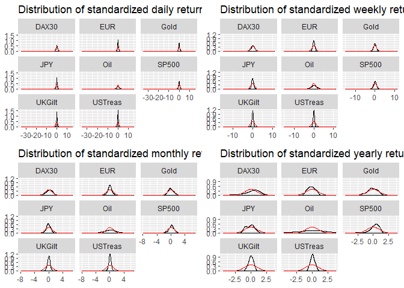
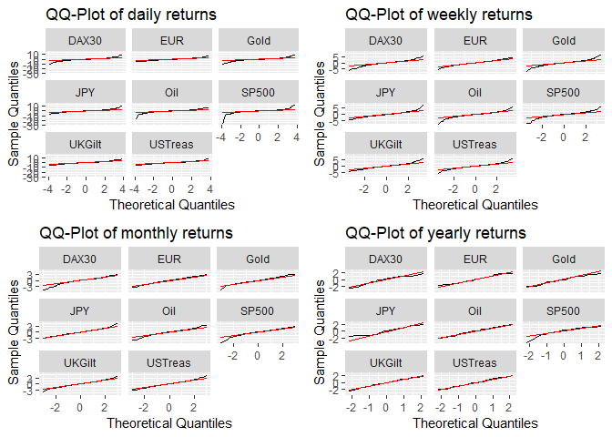

First Step - Value-at-Risk
==========================

-   We first calculated the Value-at-Risk for all asset classes at confidence intervals of 84%, 97.5% and 99.9%. The result is shown in the following table:

<table class="table" style="margin-left: auto; margin-right: auto;">
<thead>
<tr>
<th style="text-align:left;">
Asset
</th>
<th style="text-align:left;">
Horizon
</th>
<th style="text-align:right;">
VaR @ 84%
</th>
<th style="text-align:right;">
VaR @ 97.5%
</th>
<th style="text-align:right;">
VaR @ 99.9%
</th>
</tr>
</thead>
<tbody>
<tr>
<td style="text-align:left;">
DAX30
</td>
<td style="text-align:left;">
Daily
</td>
<td style="text-align:right;">
-0.0106000
</td>
<td style="text-align:right;">
-0.0291775
</td>
<td style="text-align:right;">
-0.0728910
</td>
</tr>
<tr>
<td style="text-align:left;">
DAX30
</td>
<td style="text-align:left;">
Weekly
</td>
<td style="text-align:right;">
-0.0258000
</td>
<td style="text-align:right;">
-0.0668850
</td>
<td style="text-align:right;">
-0.1376403
</td>
</tr>
<tr>
<td style="text-align:left;">
DAX30
</td>
<td style="text-align:left;">
Monthly
</td>
<td style="text-align:right;">
-0.0497600
</td>
<td style="text-align:right;">
-0.1451500
</td>
<td style="text-align:right;">
-0.2716110
</td>
</tr>
<tr>
<td style="text-align:left;">
DAX30
</td>
<td style="text-align:left;">
Yearly
</td>
<td style="text-align:right;">
-0.1503080
</td>
<td style="text-align:right;">
-0.5564800
</td>
<td style="text-align:right;">
-0.6189952
</td>
</tr>
<tr>
<td style="text-align:left;">
EUR
</td>
<td style="text-align:left;">
Daily
</td>
<td style="text-align:right;">
-0.0055000
</td>
<td style="text-align:right;">
-0.0132000
</td>
<td style="text-align:right;">
-0.0257000
</td>
</tr>
<tr>
<td style="text-align:left;">
EUR
</td>
<td style="text-align:left;">
Weekly
</td>
<td style="text-align:right;">
-0.0130000
</td>
<td style="text-align:right;">
-0.0276475
</td>
<td style="text-align:right;">
-0.0609813
</td>
</tr>
<tr>
<td style="text-align:left;">
EUR
</td>
<td style="text-align:left;">
Monthly
</td>
<td style="text-align:right;">
-0.0282400
</td>
<td style="text-align:right;">
-0.0651125
</td>
<td style="text-align:right;">
-0.1076930
</td>
</tr>
<tr>
<td style="text-align:left;">
EUR
</td>
<td style="text-align:left;">
Yearly
</td>
<td style="text-align:right;">
-0.1289680
</td>
<td style="text-align:right;">
-0.1816600
</td>
<td style="text-align:right;">
-0.1934104
</td>
</tr>
<tr>
<td style="text-align:left;">
Gold
</td>
<td style="text-align:left;">
Daily
</td>
<td style="text-align:right;">
-0.0072000
</td>
<td style="text-align:right;">
-0.0216000
</td>
<td style="text-align:right;">
-0.0575782
</td>
</tr>
<tr>
<td style="text-align:left;">
Gold
</td>
<td style="text-align:left;">
Weekly
</td>
<td style="text-align:right;">
-0.0191440
</td>
<td style="text-align:right;">
-0.0472325
</td>
<td style="text-align:right;">
-0.0942123
</td>
</tr>
<tr>
<td style="text-align:left;">
Gold
</td>
<td style="text-align:left;">
Monthly
</td>
<td style="text-align:right;">
-0.0406800
</td>
<td style="text-align:right;">
-0.0845618
</td>
<td style="text-align:right;">
-0.1746725
</td>
</tr>
<tr>
<td style="text-align:left;">
Gold
</td>
<td style="text-align:left;">
Yearly
</td>
<td style="text-align:right;">
-0.1169640
</td>
<td style="text-align:right;">
-0.3286600
</td>
<td style="text-align:right;">
-0.3361864
</td>
</tr>
<tr>
<td style="text-align:left;">
JPY
</td>
<td style="text-align:left;">
Daily
</td>
<td style="text-align:right;">
-0.0056000
</td>
<td style="text-align:right;">
-0.0130000
</td>
<td style="text-align:right;">
-0.0300173
</td>
</tr>
<tr>
<td style="text-align:left;">
JPY
</td>
<td style="text-align:left;">
Weekly
</td>
<td style="text-align:right;">
-0.0130582
</td>
<td style="text-align:right;">
-0.0287669
</td>
<td style="text-align:right;">
-0.0566583
</td>
</tr>
<tr>
<td style="text-align:left;">
JPY
</td>
<td style="text-align:left;">
Monthly
</td>
<td style="text-align:right;">
-0.0284800
</td>
<td style="text-align:right;">
-0.0638000
</td>
<td style="text-align:right;">
-0.0958057
</td>
</tr>
<tr>
<td style="text-align:left;">
JPY
</td>
<td style="text-align:left;">
Yearly
</td>
<td style="text-align:right;">
-0.1705000
</td>
<td style="text-align:right;">
-0.1894400
</td>
<td style="text-align:right;">
-0.1968896
</td>
</tr>
<tr>
<td style="text-align:left;">
Oil
</td>
<td style="text-align:left;">
Daily
</td>
<td style="text-align:right;">
-0.0168000
</td>
<td style="text-align:right;">
-0.0440000
</td>
<td style="text-align:right;">
-0.1198896
</td>
</tr>
<tr>
<td style="text-align:left;">
Oil
</td>
<td style="text-align:left;">
Weekly
</td>
<td style="text-align:right;">
-0.0392440
</td>
<td style="text-align:right;">
-0.1003475
</td>
<td style="text-align:right;">
-0.2540138
</td>
</tr>
<tr>
<td style="text-align:left;">
Oil
</td>
<td style="text-align:left;">
Monthly
</td>
<td style="text-align:right;">
-0.0873000
</td>
<td style="text-align:right;">
-0.2211125
</td>
<td style="text-align:right;">
-0.3928355
</td>
</tr>
<tr>
<td style="text-align:left;">
Oil
</td>
<td style="text-align:left;">
Yearly
</td>
<td style="text-align:right;">
-0.3716760
</td>
<td style="text-align:right;">
-0.7754600
</td>
<td style="text-align:right;">
-0.8809064
</td>
</tr>
<tr>
<td style="text-align:left;">
SP500
</td>
<td style="text-align:left;">
Daily
</td>
<td style="text-align:right;">
-0.0080000
</td>
<td style="text-align:right;">
-0.0234000
</td>
<td style="text-align:right;">
-0.0772346
</td>
</tr>
<tr>
<td style="text-align:left;">
SP500
</td>
<td style="text-align:left;">
Weekly
</td>
<td style="text-align:right;">
-0.0183000
</td>
<td style="text-align:right;">
-0.0470000
</td>
<td style="text-align:right;">
-0.1289795
</td>
</tr>
<tr>
<td style="text-align:left;">
SP500
</td>
<td style="text-align:left;">
Monthly
</td>
<td style="text-align:right;">
-0.0295200
</td>
<td style="text-align:right;">
-0.0911000
</td>
<td style="text-align:right;">
-0.2129345
</td>
</tr>
<tr>
<td style="text-align:left;">
SP500
</td>
<td style="text-align:left;">
Yearly
</td>
<td style="text-align:right;">
-0.0519760
</td>
<td style="text-align:right;">
-0.3156200
</td>
<td style="text-align:right;">
-0.4911848
</td>
</tr>
<tr>
<td style="text-align:left;">
UKGilt
</td>
<td style="text-align:left;">
Daily
</td>
<td style="text-align:right;">
-0.0037000
</td>
<td style="text-align:right;">
-0.0094000
</td>
<td style="text-align:right;">
-0.0202391
</td>
</tr>
<tr>
<td style="text-align:left;">
UKGilt
</td>
<td style="text-align:left;">
Weekly
</td>
<td style="text-align:right;">
-0.0084000
</td>
<td style="text-align:right;">
-0.0199000
</td>
<td style="text-align:right;">
-0.0362259
</td>
</tr>
<tr>
<td style="text-align:left;">
UKGilt
</td>
<td style="text-align:left;">
Monthly
</td>
<td style="text-align:right;">
-0.0178800
</td>
<td style="text-align:right;">
-0.0397375
</td>
<td style="text-align:right;">
-0.0731660
</td>
</tr>
<tr>
<td style="text-align:left;">
UKGilt
</td>
<td style="text-align:left;">
Yearly
</td>
<td style="text-align:right;">
-0.0472920
</td>
<td style="text-align:right;">
-0.1178400
</td>
<td style="text-align:right;">
-0.1498656
</td>
</tr>
<tr>
<td style="text-align:left;">
USTreas
</td>
<td style="text-align:left;">
Daily
</td>
<td style="text-align:right;">
-0.0032000
</td>
<td style="text-align:right;">
-0.0083000
</td>
<td style="text-align:right;">
-0.0170391
</td>
</tr>
<tr>
<td style="text-align:left;">
USTreas
</td>
<td style="text-align:left;">
Weekly
</td>
<td style="text-align:right;">
-0.0073440
</td>
<td style="text-align:right;">
-0.0177475
</td>
<td style="text-align:right;">
-0.0345540
</td>
</tr>
<tr>
<td style="text-align:left;">
USTreas
</td>
<td style="text-align:left;">
Monthly
</td>
<td style="text-align:right;">
-0.0136200
</td>
<td style="text-align:right;">
-0.0355250
</td>
<td style="text-align:right;">
-0.0571165
</td>
</tr>
<tr>
<td style="text-align:left;">
USTreas
</td>
<td style="text-align:left;">
Yearly
</td>
<td style="text-align:right;">
-0.0311080
</td>
<td style="text-align:right;">
-0.0870200
</td>
<td style="text-align:right;">
-0.0959288
</td>
</tr>
</tbody>
</table>

-   Then we calculated the distribution of e.g. daily returns on all asset classes and then compared it with a normal distribution

