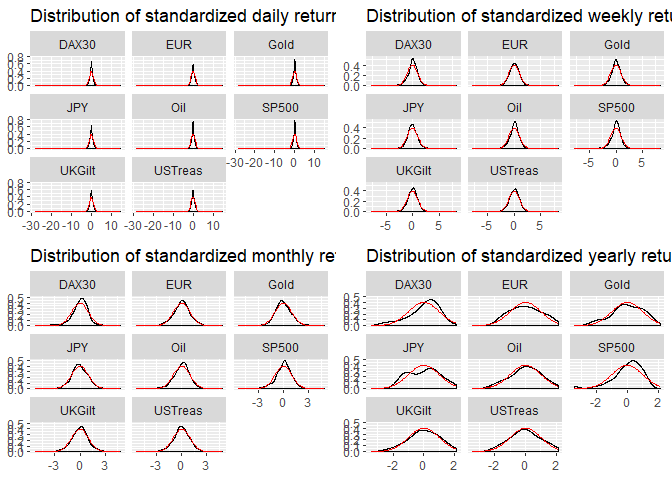

# First Step - Value-at-Risk
==========================

-   We first calculated the Value-at-Risk for all asset classes at confidence intervals of 84%, 97.5% and 99.9%. The result is shown in the following table:

<table class="table" style="margin-left: auto; margin-right: auto;">
<thead>
<tr>
<th style="text-align:left;">
Asset
</th>
<th style="text-align:left;">
Horizon
</th>
<th style="text-align:right;">
VaR 84%
</th>
<th style="text-align:right;">
VaR 97.5%
</th>
<th style="text-align:right;">
VaR 99.9%
</th>
</tr>
</thead>
<tbody>
<tr>
<td style="text-align:left;">
DAX30
</td>
<td style="text-align:left;">
Daily
</td>
<td style="text-align:right;">
0.011200
</td>
<td style="text-align:right;">
0.0271000
</td>
<td style="text-align:right;">
0.0651339
</td>
</tr>
<tr>
<td style="text-align:left;">
DAX30
</td>
<td style="text-align:left;">
Weekly
</td>
<td style="text-align:right;">
0.026900
</td>
<td style="text-align:right;">
0.0562000
</td>
<td style="text-align:right;">
0.1268202
</td>
</tr>
<tr>
<td style="text-align:left;">
DAX30
</td>
<td style="text-align:left;">
Monthly
</td>
<td style="text-align:right;">
0.057280
</td>
<td style="text-align:right;">
0.1156750
</td>
<td style="text-align:right;">
0.1767750
</td>
</tr>
<tr>
<td style="text-align:left;">
DAX30
</td>
<td style="text-align:left;">
Yearly
</td>
<td style="text-align:right;">
0.264004
</td>
<td style="text-align:right;">
0.3739600
</td>
<td style="text-align:right;">
0.4863184
</td>
</tr>
<tr>
<td style="text-align:left;">
EUR
</td>
<td style="text-align:left;">
Daily
</td>
<td style="text-align:right;">
0.005600
</td>
<td style="text-align:right;">
0.0130000
</td>
<td style="text-align:right;">
0.0261391
</td>
</tr>
<tr>
<td style="text-align:left;">
EUR
</td>
<td style="text-align:left;">
Weekly
</td>
<td style="text-align:right;">
0.012844
</td>
<td style="text-align:right;">
0.0281800
</td>
<td style="text-align:right;">
0.0510842
</td>
</tr>
<tr>
<td style="text-align:left;">
EUR
</td>
<td style="text-align:left;">
Monthly
</td>
<td style="text-align:right;">
0.027480
</td>
<td style="text-align:right;">
0.0630000
</td>
<td style="text-align:right;">
0.0861395
</td>
</tr>
<tr>
<td style="text-align:left;">
EUR
</td>
<td style="text-align:left;">
Yearly
</td>
<td style="text-align:right;">
0.123352
</td>
<td style="text-align:right;">
0.1958800
</td>
<td style="text-align:right;">
0.1981072
</td>
</tr>
<tr>
<td style="text-align:left;">
Gold
</td>
<td style="text-align:left;">
Daily
</td>
<td style="text-align:right;">
0.007900
</td>
<td style="text-align:right;">
0.0201000
</td>
<td style="text-align:right;">
0.0510692
</td>
</tr>
<tr>
<td style="text-align:left;">
Gold
</td>
<td style="text-align:left;">
Weekly
</td>
<td style="text-align:right;">
0.018900
</td>
<td style="text-align:right;">
0.0432000
</td>
<td style="text-align:right;">
0.1032742
</td>
</tr>
<tr>
<td style="text-align:left;">
Gold
</td>
<td style="text-align:left;">
Monthly
</td>
<td style="text-align:right;">
0.044360
</td>
<td style="text-align:right;">
0.0944750
</td>
<td style="text-align:right;">
0.1409405
</td>
</tr>
<tr>
<td style="text-align:left;">
Gold
</td>
<td style="text-align:left;">
Yearly
</td>
<td style="text-align:right;">
0.148964
</td>
<td style="text-align:right;">
0.2246400
</td>
<td style="text-align:right;">
0.2512896
</td>
</tr>
<tr>
<td style="text-align:left;">
JPY
</td>
<td style="text-align:left;">
Daily
</td>
<td style="text-align:right;">
0.005500
</td>
<td style="text-align:right;">
0.0138775
</td>
<td style="text-align:right;">
0.0341769
</td>
</tr>
<tr>
<td style="text-align:left;">
JPY
</td>
<td style="text-align:left;">
Weekly
</td>
<td style="text-align:right;">
0.013200
</td>
<td style="text-align:right;">
0.0329900
</td>
<td style="text-align:right;">
0.0717893
</td>
</tr>
<tr>
<td style="text-align:left;">
JPY
</td>
<td style="text-align:left;">
Monthly
</td>
<td style="text-align:right;">
0.031440
</td>
<td style="text-align:right;">
0.0637125
</td>
<td style="text-align:right;">
0.1390835
</td>
</tr>
<tr>
<td style="text-align:left;">
JPY
</td>
<td style="text-align:left;">
Yearly
</td>
<td style="text-align:right;">
0.105696
</td>
<td style="text-align:right;">
0.2181600
</td>
<td style="text-align:right;">
0.2310624
</td>
</tr>
<tr>
<td style="text-align:left;">
Oil
</td>
<td style="text-align:left;">
Daily
</td>
<td style="text-align:right;">
0.017400
</td>
<td style="text-align:right;">
0.0440424
</td>
<td style="text-align:right;">
0.1134979
</td>
</tr>
<tr>
<td style="text-align:left;">
Oil
</td>
<td style="text-align:left;">
Weekly
</td>
<td style="text-align:right;">
0.040944
</td>
<td style="text-align:right;">
0.0877850
</td>
<td style="text-align:right;">
0.1909670
</td>
</tr>
<tr>
<td style="text-align:left;">
Oil
</td>
<td style="text-align:left;">
Monthly
</td>
<td style="text-align:right;">
0.089440
</td>
<td style="text-align:right;">
0.1835000
</td>
<td style="text-align:right;">
0.3488840
</td>
</tr>
<tr>
<td style="text-align:left;">
Oil
</td>
<td style="text-align:left;">
Yearly
</td>
<td style="text-align:right;">
0.409308
</td>
<td style="text-align:right;">
0.7594800
</td>
<td style="text-align:right;">
0.7985712
</td>
</tr>
<tr>
<td style="text-align:left;">
SP500
</td>
<td style="text-align:left;">
Daily
</td>
<td style="text-align:right;">
0.008400
</td>
<td style="text-align:right;">
0.0213775
</td>
<td style="text-align:right;">
0.0582256
</td>
</tr>
<tr>
<td style="text-align:left;">
SP500
</td>
<td style="text-align:left;">
Weekly
</td>
<td style="text-align:right;">
0.019800
</td>
<td style="text-align:right;">
0.0435950
</td>
<td style="text-align:right;">
0.0997209
</td>
</tr>
<tr>
<td style="text-align:left;">
SP500
</td>
<td style="text-align:left;">
Monthly
</td>
<td style="text-align:right;">
0.043280
</td>
<td style="text-align:right;">
0.0827750
</td>
<td style="text-align:right;">
0.1161420
</td>
</tr>
<tr>
<td style="text-align:left;">
SP500
</td>
<td style="text-align:left;">
Yearly
</td>
<td style="text-align:right;">
0.206228
</td>
<td style="text-align:right;">
0.2626000
</td>
<td style="text-align:right;">
0.2733520
</td>
</tr>
<tr>
<td style="text-align:left;">
UKGilt
</td>
<td style="text-align:left;">
Daily
</td>
<td style="text-align:right;">
0.004000
</td>
<td style="text-align:right;">
0.0089000
</td>
<td style="text-align:right;">
0.0235955
</td>
</tr>
<tr>
<td style="text-align:left;">
UKGilt
</td>
<td style="text-align:left;">
Weekly
</td>
<td style="text-align:right;">
0.009500
</td>
<td style="text-align:right;">
0.0194000
</td>
<td style="text-align:right;">
0.0483648
</td>
</tr>
<tr>
<td style="text-align:left;">
UKGilt
</td>
<td style="text-align:left;">
Monthly
</td>
<td style="text-align:right;">
0.020720
</td>
<td style="text-align:right;">
0.0457001
</td>
<td style="text-align:right;">
0.0808720
</td>
</tr>
<tr>
<td style="text-align:left;">
UKGilt
</td>
<td style="text-align:left;">
Yearly
</td>
<td style="text-align:right;">
0.103120
</td>
<td style="text-align:right;">
0.1509400
</td>
<td style="text-align:right;">
0.1722136
</td>
</tr>
<tr>
<td style="text-align:left;">
USTreas
</td>
<td style="text-align:left;">
Daily
</td>
<td style="text-align:right;">
0.003600
</td>
<td style="text-align:right;">
0.0082000
</td>
<td style="text-align:right;">
0.0183391
</td>
</tr>
<tr>
<td style="text-align:left;">
USTreas
</td>
<td style="text-align:left;">
Weekly
</td>
<td style="text-align:right;">
0.009244
</td>
<td style="text-align:right;">
0.0176950
</td>
<td style="text-align:right;">
0.0368080
</td>
</tr>
<tr>
<td style="text-align:left;">
USTreas
</td>
<td style="text-align:left;">
Monthly
</td>
<td style="text-align:right;">
0.021500
</td>
<td style="text-align:right;">
0.0423250
</td>
<td style="text-align:right;">
0.0792715
</td>
</tr>
<tr>
<td style="text-align:left;">
USTreas
</td>
<td style="text-align:left;">
Yearly
</td>
<td style="text-align:right;">
0.117776
</td>
<td style="text-align:right;">
0.1652400
</td>
<td style="text-align:right;">
0.1953456
</td>
</tr>
</tbody>
</table>

-   Then we calculated the distribution of e.g. daily returns on all asset classes and then compared it with a normal distribution
-   We observed that the distributions follow the assumptions of normal distributed returns almost perfectly
-   Although we can observe a fat tailed distribution on S&P 500 on yearly returns and also a bimodal distribution on JPY on yearly returns

